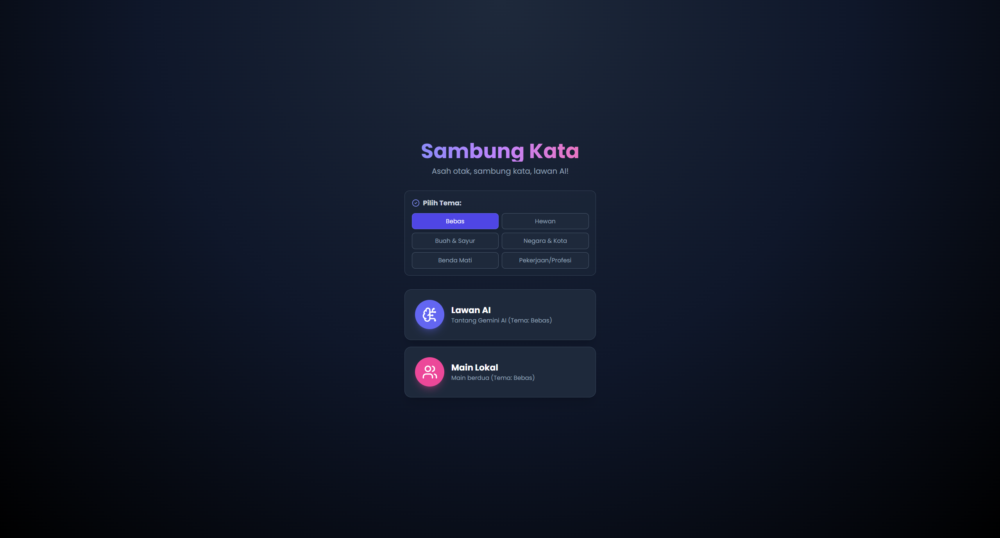

# 🎮 Sambung Kata AI

**Sambung Kata AI** adalah permainan asah otak klasik "Word Chain" (Sambung Kata) yang dimodernisasi menggunakan **Google Gemini AI**. 

Pemain ditantang untuk menyambung kata berdasarkan huruf terakhir dari kata sebelumnya. Game ini mendukung input suara (Voice Recognition) dan memiliki fitur validasi cerdas untuk memastikan kata yang digunakan valid dalam Bahasa Indonesia dan sesuai dengan tema yang dipilih.



## ✨ Fitur Unggulan

*   **🧠 Lawan AI Cerdas:** Tantang Gemini AI yang tidak pernah kehabisan kata-kata.
*   **👥 Mode PvP Lokal:** Main berdua dengan teman di satu perangkat.
*   **🎙️ Input Suara:** Tidak perlu mengetik! Cukup ucapkan kata, dan game akan mendeteksinya.
*   **🎨 Sistem Tema:** Pilih topik permainan (Hewan, Buah, Negara, Pekerjaan, dll) untuk tantangan lebih seru.
*   **🔥 Sistem Streak:** Seberapa panjang rangkaian kata yang bisa kamu buat tanpa putus?
*   **⚡ Validasi Otomatis:** AI mengecek apakah kata tersebut ada di KBBI dan sesuai tema secara *real-time*.
*   **⏱️ Timer Menegangkan:** Kamu hanya punya 30 detik setiap giliran!

## 🛠️ Teknologi yang Digunakan

*   **Frontend:** React (TypeScript)
*   **Styling:** Tailwind CSS
*   **AI Core:** Google GenAI SDK (`gemini-2.5-flash`)
*   **Voice:** Web Speech API
*   **Icons:** Lucide React

## 🚀 Cara Menjalankan Project

Ikuti langkah-langkah ini untuk menjalankan game di komputer kamu:

1.  **Clone Repository**
    ```bash
    git clone https://github.com/USERNAME/sambung-kata-ai.git
    cd sambung-kata-ai
    ```

2.  **Install Dependencies**
    ```bash
    npm install
    ```

3.  **Setup API Key**
    *   Dapatkan API Key gratis di [Google AI Studio](https://aistudio.google.com/).
    *   Buat file `.env` di root folder.
    *   Tambahkan baris berikut:
        ```env
        API_KEY=masukkan_api_key_google_kamu_disini
        ```

4.  **Jalankan Aplikasi**
    ```bash
    npm start
    # atau jika menggunakan Vite
    npm run dev
    ```

## 🎯 Cara Bermain

1.  **Pilih Mode:** Lawan AI atau Teman.
2.  **Pilih Tema:** Tentukan topik (misal: "Hewan").
3.  **Mulai:** Ketik atau ucapkan kata pertama yang sesuai tema.
4.  **Sambung:** Pemain selanjutnya harus membuat kata baru yang berawalan dari **huruf terakhir** kata sebelumnya.
    *   *Contoh:* Gaja**h** -> **H**arima**u** -> **U**la**r**.
5.  **Aturan:**
    *   Kata harus baku (Bahasa Indonesia).
    *   Kata harus sesuai tema (jika tema bukan "Bebas").
    *   Tidak boleh mengulang kata yang sudah dipakai.
    *   Waktu habis = Kalah.

## 🤝 Kontribusi

Pull Request sangat dipersilakan! Jika kamu punya ide fitur baru atau perbaikan bug:
1.  Fork project ini.
2.  Buat feature branch (`git checkout -b fitur-keren`).
3.  Commit perubahan (`git commit -m 'Menambah fitur keren'`).
4.  Push ke branch (`git push origin fitur-keren`).
5.  Buat Pull Request.

## 📄 Lisensi

MIT License - Bebas digunakan dan dimodifikasi untuk tujuan pembelajaran.
